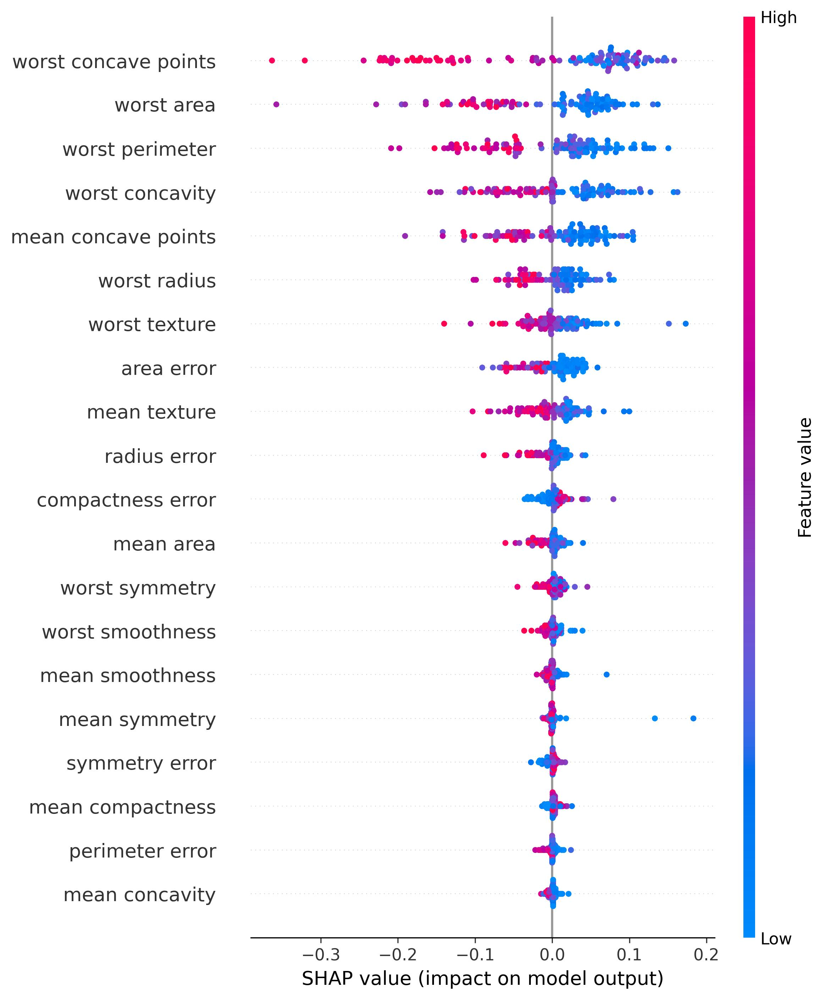

# Interpretable LightGBM with SHAP

<div align="center">
  
</div>


## Motivation

Building predictive models, LightGBM is a go-to baseline solution due to its speed and performance. However, while boosting algorithms excel at prediction, their ensemble nature (combining multiple weak learners) makes them inherently difficult to interpret. 

When deploying models for customer-facing services, the ability to explain model behavior becomes as crucial as predictive accuracy. This wrapper bridges that gap by providing a single-module solution to interpret LightGBM models using SHAP (SHapley Additive exPlanations) values - a game theory approach that explains model outputs through feature contributions.

## Key Features

- **One-stop interpretation**: All major SHAP visualizations in a unified interface
- **Production-ready**: Automatic saving of visualizations with timestamped filenames
- **Flexible input**: Works with both native LGBM and scikit-learn API models
- **Clear insights**: Visual explanations that stakeholders can understand

## Visualization Demos

<div align="center">

| Plot Type | Example | Description |
|-----------|---------|-------------|
| **Summary Plot** |  | Global feature importance and impact direction |
| **Feature Importance** |  | Quantitative feature rankings |
| **Dependence Plot** |  | Feature behavior and interactions |
| **Force Plot** |  | Individual prediction breakdown |
| **Decision Plot** |  | Prediction path visualization |
| **Waterfall Plot** |  | Step-by-step feature contributions |

</div>

## Why This Matters

1. **Build Trust** - Show customers exactly how predictions are made
2. **Debug Models** - Identify problematic features or unexpected behaviors
3. **Meet Regulations** - Comply with "right to explanation" requirements
4. **Improve Models** - Gain insights for feature engineering

## Installation

```bash
pip install lightgbm shap matplotlib pandas numpy
```

## Usage
```python
from interpretable_lgbm import LGBM_SHAP_Explainer

# Initialize with trained model
explainer = LGBM_SHAP_Explainer(
    model=your_trained_lgbm,
    train_data=X_train,
    feature_names=feature_names
)

# Generate and save explanations
explainer.summary_plot(X_test, save=True)
explainer.dependence_plot("important_feature", X_test)
```

## Contributing
Pull requests welcome! Please open an issue first to discuss proposed changes.

## License
MIT